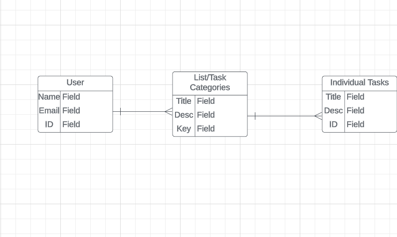
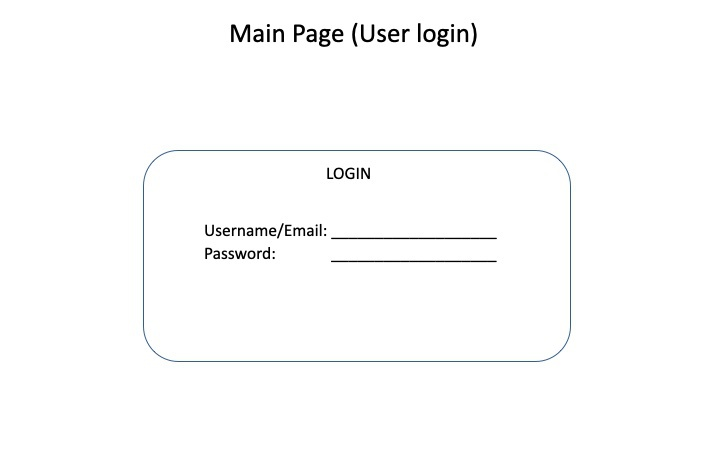
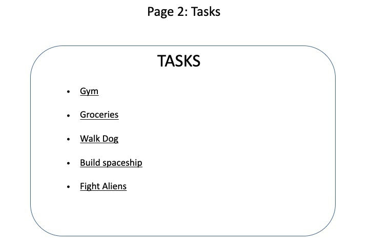
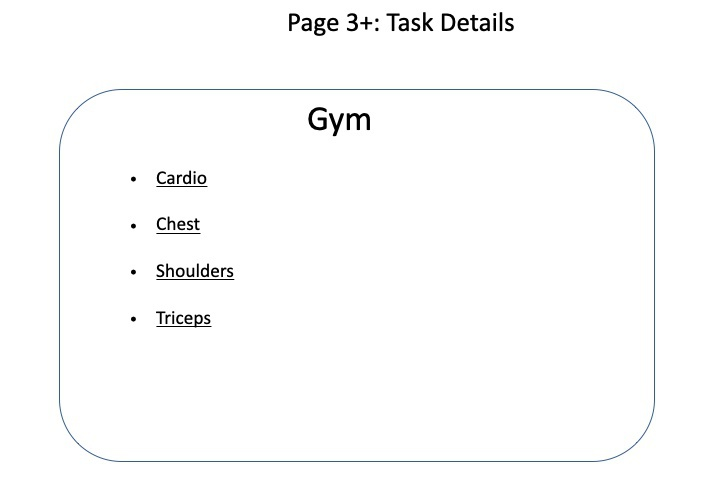
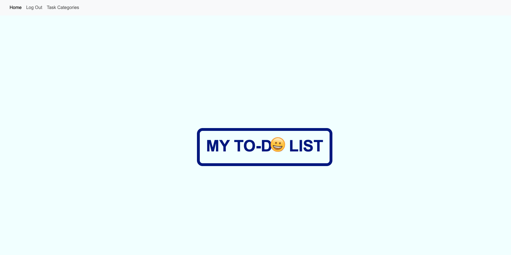
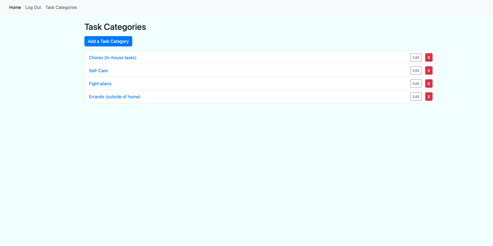
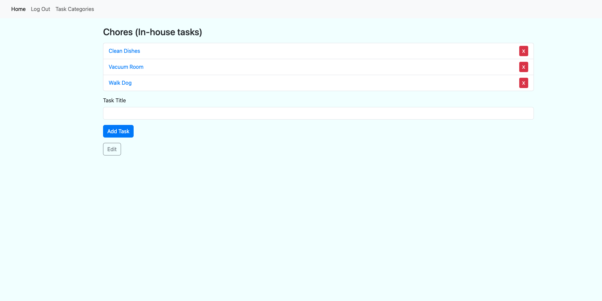

# My To-Do List

## Description
### This is a to-do list app. It is meant for users who would like a web-based task-tracker that they can access at all times.

## Entity Relationship Diagram (ERD)

## Wireframes

## Screenshots for app

## List of technologies
### This app made use of the following technologies: 
* Node.js 
* Express
* Bootstrap
* Javascript 
* HTML 
* CSS 
* MongoDB
* Mongoose 
* Google OAuth
* fly.io (for deployment)

## How to use
### On the main login page, you will see a login option on the top right-hand corner of the screen. Login using your google credentials (an email and password to your google account). After logging in, click on the ’Task Categories’ tab to navigate to where the task categories are. Here, you can view, create, delete, and edit the categories for your tasks. You cannot create a task in your to-do list without creating a category first. After creating the category, clicking on said category will allow you to create tasks in that category. 

## Planned future enhancements
### The ability to assign priority labels to each task is a planned future enhancement. 

## Trello boards ink
### Link to the Trello board: https://trello.com/b/peikUgO9/project-2-to-do-list

## Deployed app link
### Link to deployed app: https://mytodolist.fly.dev/
